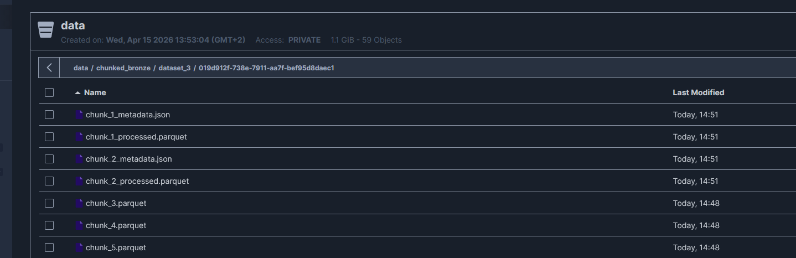
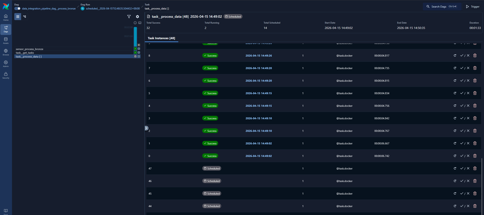
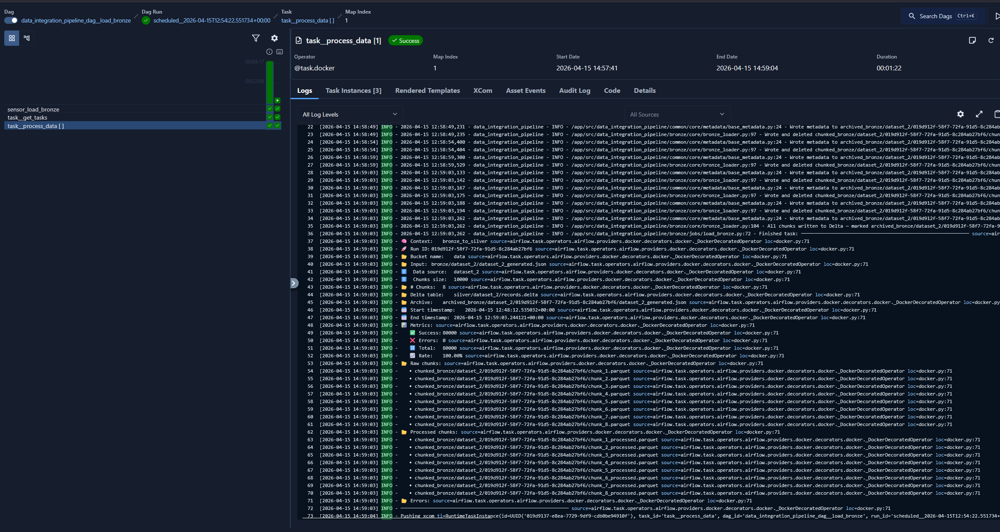
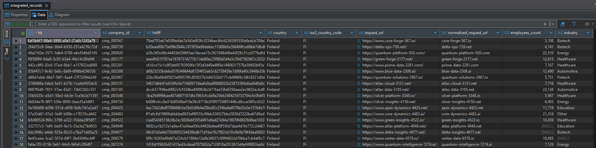
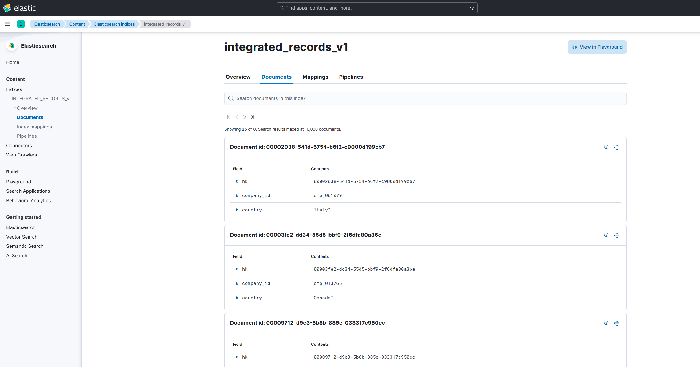
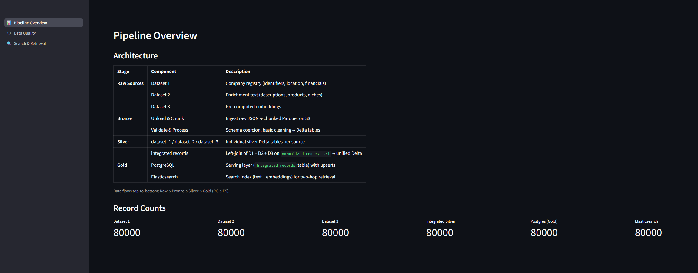
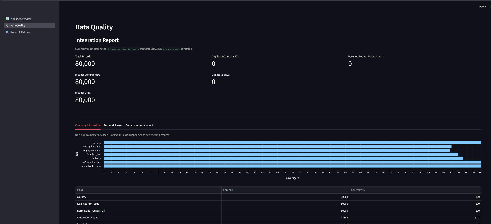
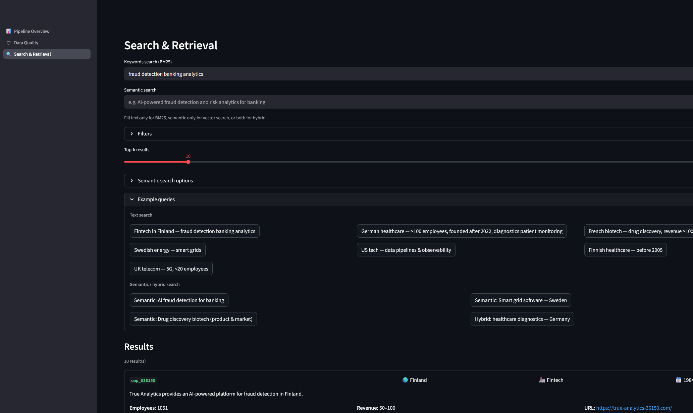

# Technical Report

# **[Documentation](https://pedromtq.github.io/data_integration_pipeline_streamlit/)**


---

## Data, assumptions, and limitations

### Source Datasets

The pipeline ingests three JSON datasets, each representing a different facet of company information:

| Dataset | Content | Key | Records |
|---------|---------|-----|---------|
| **Dataset 1** | Company registry: company ID, country, industry, employee count, founded year, revenue range, short description, website URL | `company_id` | One row per company |
| **Dataset 2** | URL-keyed enrichment: long business description, products/services, market niches, business model (all text) | `url` | One row per URL |
| **Dataset 3** | URL-keyed embeddings: five dense vectors (business description, short description, products, niches, business model) + embedding timestamp | `url` | One row per URL |

**I'm not using the provided dataset 3 file, instead I took the descriptions from dataset 1 and 2 and generated real embeddings**. This file has the same format as the original dataset 3 file, plus an additional global embedding containing all descriptions+keywords embedded into a single vector; this was done so that I could use semantic search on both the individual fields as well as on a global embedding.

### Disclaimers

This submission is original work authored by me. It builds on reusable patterns from my earlier public project, [data_integration_pipeline](https://github.com/PedroMTQ/data_integration_pipeline), and has been adapted and extended for this technical assessment.

I didn't  focus too much on the entity resolution (ER) segment as the original datasets lacked features for proper ER, so the section could be expanded much more. Anyhow, this is a complex topic, and very dependant on the source data. If you'd like to check an example of how you can approach this via probabilistic ER, you can check this [link](https://github.com/PedroMTQ/data_integration_pipeline/blob/main/src/data_integration_pipeline/core/entity_resolution/integrated_record.py), where I don't have any canonical entities, instead these are generated through dynamic entity anchors.


### Main data outcome

The primary output artifact (the integrated dataset produced from all three sources) is available in a public S3 bucket.

```
https://pmtq-data.fsn1.your-objectstorage.com/dip_test_data/output/integrated_delta.zip
```

There's a few ways to go about checking the main outcomes.

1. You can run the full pipeline locally:
```bash
make docker-infra-up
make install
make activate
dip pipeline
# launch dashboard
dip streamlit
```

2. You can run the full pipeline in airflow:

```bash
make docker-build
make docker-up
make install
make activate
dip download-bronze
dip upload-bronze
```

Go to [Airflow](http://localhost:8080/dags) and enable and run the DAGs.
Launch streamlit:
```bash
dip streamlit
```

3. Download the final output file and sync the data:

```bash
make docker-infra-up
make install
make activate
# this will load the final output  delta table into S3, and sync PG and ES
dip load-output-data
dip streamlit
```

For evaluation, I recommend option **1** or 3.
The Airflow path is included to demonstrate orchestration design, but it introduces additional operational overhead for a small demo run.

**Note that if you go with option 3 and only load the output data, you won't have the delta tables per data set and so the dashboard will not be fully operational**
You will get these errors:
```txt
Could not fetch count for Dataset 1: Generic delta kernel error: No files in log segment
```

You can still run the search since is depends solely on PG and ES, which are also loaded with `load-output-data`.


### Screenshots


#### Chunk processing:



#### Parallel processing:



#### Metadata and logs example:



#### Postgres:



#### Elastic:



#### Dashboard overview:



#### Dashboard data quality metrics:



#### Dashboard search:




### Design decisions

-  **Separation of concerns**: I've designed this workflow using a medallion architecture, where each layer itself is also split into sub-tasks. This allows for better retries, better pipeline observability, parallelism, etc. Another obvious benefit is that this allows for proper containerization of processes, which can then be deployed with Airflow or other orchestrators (I've included the respective dags in `dags/dags.py`).
- **Cloud storage**:  Note that all data processing runs in parallel containers, and that data is never hosted locally (except the initial loading of test data); instead the data is instead streamed to each container, processed, and then written back to S3.
- **Delta tables as data storage** since these automatically have CDC. They are also quite versatile since they can just be stored in S3 as parquet files. ES and PG are still using as serving layers when quick reads are crucial.
- **Row-by-row processing**: This is the biggest processing bottleneck, which is inevitable due to the nature of performing complex data transformation and validation with pydantic. We could alternatively perform data validation with e.g., dbt, but this would not result in the same final data quality (or would just result in very complex data models). It really depends on the complexity of the processing, code readability, and throughput demands. I personally prefer higher code readability and more complex data validations, even if I lose some performance. 
- **Parallelism boundary**: Once a file is chunked (`DEFAULT_CHUNK_SIZE=10000`), each chunk can be processed independently and in parallel by `process_bronze`. The chunking step itself is sequential per file (it reads a single stream), but downstream bronze-processing work fans out.
- **Format normalization**: Raw files arrive as JSON or Parquet. After chunking, everything is uniform Parquet, simplifying the processing and loading steps.
- **Ephemeral chunks**: Each chunk is deleted after being processed/loaded, this not only preserves storage, but also provides exactly-once semantics without requiring a separate state store, i.e., the absence of the file in `bronze/` is the signal that it has been handled.
- **Metadata as coordination**: The `BronzeToSilverProcessingMetadata` JSON acts as a lightweight "run manifest" that downstream jobs read to discover work. This avoids tight coupling between jobs.
- **Metadata**: Every task produces a metadata file which can be checked after the job finishes. This metadata is task specific.
- **Data streaming**: Data is always read lazily and only materialized into RAM when needed, this applies to  all the data loading methods (raw files, delta, PG, ES, etc)
- **Data upserts via hdiff**: Data is only loaded when the records' `hdiff` changes, meaning that if the raw data or processing changes for a certain row, the data is re-loaded into the delta table. This avoids upserting the data multiple times and ensures that the `load_ldts` of each record is not updated every time.
- **Schema enforcement**: The Pydantic data model acts as a contract. Every record that passes validation is guaranteed to conform to the silver schema. This eliminates the need for defensive parsing downstream.
- **Stats caching**: I created a view for the stats report which is cached when running Streamlit. Other Streamlit query results are also cached
- **Index aliasing**: The ES physical index (`integrated_records_v1`) is fronted by a read/write alias (`integrated_records`). This supports zero-downtime re-indexing: build a new versioned index, swap the alias.
- **Gold syncing (PG+ES) resuming** is achieved by tracking delta table fragments or HKs in each job (periodically stored in the metadata).
- **Bronze/Silver resuming**: For bronze and silver tasks, data is chunked and if an error is encountered, the processing can just be restarted; since the chunks are small, minimal processing power is lost.
- **Audits sampling over full scan**: Auditing every row in a large Delta table would be prohibitively expensive. Reservoir sampling provides statistically representative coverage with a fixed memory and time budget.
- **Audits weighted sampling**: Using the partition key as the weight column ensures that all geographic regions (or other partitions) are represented in the sample, even if some partitions are much larger than others. This is ideal since we usually want to have samples from every partition, but also need to pay special attention to specific partitions (e.g., the geographical market we are targetting)
- **Severity-tiered results**: Not all failures are equal. Critical failures (primary key issues) should block the pipeline; warnings (slightly-below-threshold null rates) are informational. This prevents minor data quality issues from halting the entire pipeline.
- **Spark for record linkage**: The integration step involves multi-table joins that benefit from Spark's distributed execution model, especially as datasets grow. Using Spark here (vs. PyArrow or Polars) provides a natural path to scaling. I'm using the dev/local Spark engine.
- **AI-generated docs**: I've used AI to generate the documentation, but note that each documentation file has been reviewed.


### Assumptions

- **Entity model:** Dataset 1 defines the canonical entity (one company = one `company_id`). Datasets 2 and 3 enrich entities via their website URL.
- **Join cardinality:** A company in Dataset 1 maps to zero or one URL in Datasets 2/3. It is possible (and likely) that dataset multiple entities in dataset 1 match with the same entity in dataset 2/3.
- **Dataset 2 ↔ Dataset 3 Assumed to be 1:1 on URL**. If multiple embedding versions exist per URL (`embedding_updated_at`), the latest should be used. The current implementation relies on the Delta merge (last-write-wins on the same primary key) to handle this.
- **File to data model mapping relies on a strict name pattern defined in the `ModelMapper` class**. It also assumes that the respective data models are defined for each data stage (bronze/silver/gold), although not every data stage is required.
- **Hash keys (primary keys) are deterministic (`utils.py/get_hk`) and derived from the data source name and primary key of the data model**. If either changes, or the hashing mechanism is altered, then hash keys would also be changed. 
- **Basic entity resolution**: ER is done in a simplistic manner (URL based) but this is not really the case in a real production scenario

### Potential improvements & issues

- **Postgres-to-ES consistency**: There is no transactional guarantee between Postgres and ES. If the Postgres table is updated while an ES sync is in progress, the ES index may contain a mix of old and new records until the sync completes or is re-run.
- **Aliases and schemas are not safe to changes**. If the schema of the data changes, we may get silent and non silent errors. Ideally, this would be better supported. The same can be said about schema migration, which is at the moment not supported
- **Left join means unmatched enrichment records are silently discarded**: If a URL exists in Dataset 2 or 3 but not in Dataset 1 (the seed), that enrichment data is never surfaced. There is no reporting of how many enrichment records went unused. This could be improved by adding an ER layer where we score each link and respective merged record, something like [this](https://github.com/PedroMTQ/data_integration_pipeline/blob/main/src/data_integration_pipeline/core/entity_resolution/integrated_record.py).
- **Synchronous delta loading**: Data loading into delta tables is synchronous per delta table. This could be improved by loading splitting the data into partitions; however this would require data partitioning (I already do so by iso country code and request url). This is feasible, but at this point it just adds complexity.
- **Pandas for audit dataframe**; I've tried using Duckdb with GX but I believe at this point in time it's not supported. I imagine this would change in the future; but for now we just materialize the audit data with Pandas. This is also one of the reasons why I don't audit the whole data (the other one is that it would take too long...).
- **Test coverage**: Unit and integration tests exist (`tests/`) but coverage could be expanded, particularly for edge cases and error paths.
- **Logging and metrics**: Logging needs to be improved (maybe OTEL?) and we also need better metrics exposure, e.g., prometheus scraping metadata files and serving to Grafana, or storing as a view and serving to Superset
- **Schema registry:** A centralized schema registry would enforce contracts across teams producing and consuming data.
- **Data catalog:** Integration with a data catalog (DataHub, Amundsen) for discoverability and lineage tracking.
- **Spark joins overhead**: It seems that Spark adds a lot of overhead and seems quite unstable, and we could do without it. For this amount of data, there is not much of a benefit to using it. I added Duckdb as an alternative engine, but I need to investigate what is the best option here.


---

# Workflow

## Bronze Layer

### Chunking

Raw JSON/Parquet files are split into fixed-size chunks (default 10,000 rows) and written as Parquet to S3. This serves two purposes:

1. **Bounded memory:** Large files (hundreds of GB) can be processed without loading everything into memory.
2. **Parallelism:** Each chunk is an independent unit of work that can be processed and loaded in parallel (Airflow maps over chunks).

The original raw file is archived after chunking, preserving an immutable copy of the source data.

### Pydantic Row-Level Validation

Each row is validated against a source-specific Pydantic model. The validation includes:

- **Type coercion:** Strings to integers (employee count, founded year), lists from newline/pipe-delimited strings (products, niches, business model).
- **URL normalization:** Fixes common URL issues (missing scheme, doubled `://`, typos in `http`/`https`), then produces a canonical `normalized_request_url` for cross-source joining.
- **Country standardization:** Uses `country_converter` to normalize free-text country names and derive ISO2 codes.
- **Revenue parsing:** Extracts numeric bounds from range strings like `"100M-500M"`.
- **Embedding validation:** Verifies vector dimensionality matches the configured `EMBEDDING_DIMENSIONS`.

**Invalid rows are not dropped.** They are written to a separate errors Parquet file under the archived bronze path. This enables later inspection, reprocessing, or alerting without data loss.

**Tradeoff:** Pydantic per-row validation is slower than batch-level schema enforcement (e.g., PyArrow cast). For a dataset of this size it is fast enough, and the benefit is precise, per-field error messages with full context. At extreme scale (billions of rows), a hybrid approach would make sense: fast PyArrow schema checks first, Pydantic only for rows that need coercion or complex validation.

### Delta Lake Writes

Validated rows are written to per-source Delta tables (`silver/dataset_1/records.delta`, etc.) using the Python `deltalake` library. Writes use **merge semantics**: new rows are inserted, existing rows (matched by primary key) are updated only if the hash-diff column (`hdiff`) has changed.

**Why Delta Lake over plain Parquet:**
- ACID transactions prevent partial writes from corrupting the table.
- Merge/upsert semantics enable idempotent re-runs (safe to re-process the same data).
- Time travel enables debugging and rollback.
- Partition pruning on `iso2_country_code` (Dataset 1) speeds up filtered reads.

**Tradeoff:** Delta adds operational overhead — tables need periodic `OPTIMIZE` (compaction) and `VACUUM` (old file cleanup). These are implemented as scheduled Airflow DAGs (daily).

---

## Silver Layer


### Entity resolution

With the given data, the only feasible way to merge the datasets is via `normalized_request_url`, which can be done trivially through a table join. However, in real scenarios, this is rarely the case, quite often you depend on deterministic features (e.g., IDS, URLs) along natural language features, such as company names, geolocation, etc. For the latter, you cannot simply do table joins as these features often have misspellings, missing tokens, etc; so in this scenario you can proceed with blocking mechanisms to reduce similarity matrices which can then support deterministic (e.g., fuzzy matching) or probabilistic record linking methods.  

### PySpark Multi-Source Join

The three per-source Delta tables are joined into a single integrated Delta table using PySpark:

- **Seed source:** Dataset 1 (company registry) is the left side of the join.
- **Join key:** `normalized_request_url` — the canonicalized URL shared across all three datasets.
- **Join type:** Left join — every company from Dataset 1 appears in the output, with enrichment fields null if no matching URL exists in Datasets 2/3.
- **Column mapping:** Pydantic field aliases (`AliasPath('dataset_2', 'desc__description_long')`) declaratively map which source contributes each field to the integrated schema.

After the join, a **schema contract check** (`assert_schema_matches`) verifies the output DataFrame matches the expected PyArrow schema. This catches unexpected column additions, removals, or type changes before they propagate downstream.

**Staleness gate:** Before running the join, the job compares Delta commit timestamps of input tables versus the output table. If inputs haven't changed since the last integration, the job skips — avoiding expensive Spark work for no-op runs.

**Why PySpark instead of Polars or DuckDB:**
- PySpark is the industry standard for distributed data processing at scale. At 360M+ records across three sources, the join can exceed single-machine memory.
- Spark's Delta Lake connector (`delta-spark`) provides native read/write with full merge semantics.
- The same Spark job can run on a local `SparkSession` for development and on a cluster in production with no code changes.

**Tradeoff:** PySpark requires a JVM, adds ~10 seconds of startup overhead, and uses more memory than Polars for small datasets. For this assessment's data volume, Polars would be faster. The choice reflects the production intent of the design. (I also wanted to experiment with Spark)

---

## Gold Layer

### PostgreSQL as the Serving Layer

The integrated Delta table is streamed into PostgreSQL via the `PostgresClient`. This is the system of record for complete company data.

**Upsert strategy:** `INSERT ... ON CONFLICT (hk) DO UPDATE SET ... WHERE excluded.hdiff != integrated_records.hdiff`. The `hdiff` column is a SHA-256 hash of the record's descriptive payload (excluding internal metadata, e.g., `load_ldts`). This means:

- Unchanged records cause no write I/O (the `WHERE` clause short-circuits the update).
- Changed records are updated atomically.
- New records are inserted.

**Schema management:** SQL schemas files under `gold/schemas/` are executed by `SchemaManager` on startup. Tables are created with `IF NOT EXISTS`, making the process idempotent. Indexes on `company_id` and `normalized_request_url` support common lookup patterns.

**Resume mechanism (Delta → PostgreSQL):** Processing tracks the Delta file fragment index and the Delta table's last commit timestamp (LDTS). On restart:
- If the Delta table has not been modified (same LDTS), processing resumes from the last completed fragment.
- If the Delta table has been modified (new LDTS), the fragment index resets to zero and a full re-sync occurs (safe due to idempotent upserts).

This fragment-based approach avoids sorting within Delta files (which would negate the performance benefits of columnar scans) while still enabling progress checkpointing for large tables.

### Elasticsearch as the Search Index

PostgreSQL records are indexed into Elasticsearch for efficient search and retrieval. Only search-relevant fields are indexed:

| Field Type | Fields | ES Mapping |
|------------|--------|------------|
| Identifiers | `hk`, `company_id` | `keyword` |
| Full-text search | `description_short`, `business_description` | `text` |
| Text + keyword | `industry`, `product_services`, `market_niches`, `business_model` | `text` with `keyword` sub-field (lowercase + ASCII folding normalizer) |
| Keyword filters | `country`, `iso2_country_code`, `normalized_request_url` | `keyword` with normalizer |
| Numeric filters | `employees_count`, `founded_year`, `revenue_*_bound` | `integer` / `long` |
| Dense vectors | 5 embedding fields | `dense_vector` (cosine similarity, indexed for KNN) |

**Why not store full documents in ES?** The two-hop pattern (ES → PG) keeps the ES index lean:
- ES storage is expensive at scale (replicas, SSD-backed nodes). Storing only search-relevant fields reduces index size significantly.
- Non-search fields (revenue units, raw URLs, embedding timestamps) add no value to the ES index.

**Tradeoff:** Each query requires a second network hop to PostgreSQL to fetch full records. For the expected query patterns (search → display results), this latency (~1-5ms for a batch PK lookup) is negligible compared to the ES search itself.

**Resume mechanism (PostgreSQL → ES):** Simple PK-based cursor: `WHERE hk > last_synced_pk ORDER BY hk`. PostgreSQL's UUID primary key provides a natural sort order.

---

## Search and Retrieval Design

The `QueryClient` implements a unified search interface that supports such usecases:

- fintech companies in Finland working on fraud detection or banking analytics
- German healthcare companies focused on diagnostics and patient monitoring with more than 100 employees founded after 2022
- Biotech startups in France working on drug discovery with revenue above 100M
- Energy companies in Sweden building software for smart grids or renewable forecasting
- US technology companies building infrastructure for data pipelines and observability
- healthcare companies in Finland focused on diagnostics founded before 2005
- telecom companies in the UK working on 5G analytics with fewer than 20 employees

**I've included both keyword-based search (BM25) as well as semantic search (through the dataset 3 embeddings)**

### Query Strategies

The `SearchFilters` Pydantic model captures a structured query intent. The `QueryClient` translates it into the appropriate Elasticsearch query:

1. **BM25 full-text search** (`query_text` is set): `multi_match` across all descriptive fields (see below).
```python
_DEFAULT_TEXT_FIELDS = [
    # sets description_short^2 to boost relevance of short description
    'description_short^2',
    'description_long',
    # adds industry, product_services, market_niches, business_model to the search
    'industry',
    'product_services',
    'market_niches^2',
    'business_model^2',
]
```

2. **KNN semantic search** (`semantic_query` is set): Dense vector similarity search against a specified embedding field.
3. **Filter-only search** (neither text nor vector): `match_all` with filter clauses.

All three strategies support optional **filter clauses** that are combined as `bool.filter`:
- **Keyword filters** (`term`): country, ISO2 code, company ID, URL — exact match, case-insensitive via the lowercase normalizer.
- **Text match filters** (`match`): industry, products, niches, business model — analyzed text matching.
- **Numeric range filters** (`range`): employee count, founded year, revenue bounds — inclusive lower/upper bounds.

### LLM/SLM Integration Design

The `SearchFilters` model is designed to be populated by an LLM. Each field has a descriptive `description` parameter that serves as a prompt hint. An LLM/SLM can parse a natural language query like *"Show German healthcare companies focused on diagnostics with more than 100 employees founded after 2022"* into:

```python
SearchFilters(
    query_text="diagnostics patient monitoring",
    country="germany",
    industry="healthcare",
    min_employees=100,
    min_founded_year=2022,
)
```

This component is intentionally out of scope for this submission; however, the SearchFilters contract is designed so an LLM/SLM parser can be added as a thin translation layer using either off-the-shelf structured-output tooling or a domain-tuned lightweight model.


---


## Data Quality

Data quality is enforced at three levels:

### Bronze: Row-Level Validation

Every row passes through a Pydantic model that enforces:
- Type constraints (strings, integers, lists, datetimes)
- URL format validation and normalization
- Country name standardization (free-text → ISO standard via `country_converter`)
- Embedding dimensionality checks
- Revenue range parsing

Invalid rows are separated into error Parquet files — they are never silently dropped.

### Silver: Statistical Audits

Great Expectations runs on sampled Delta table data (weighted reservoir sampling, default 1,000 rows). Built-in rules include:

| Rule | Severity | Example |
|------|----------|---------|
| Primary key not null | Critical | `company_id` must never be null |
| Primary key unique | Critical | No duplicate `company_id` values |
| ISO2 code length | Warning | `iso2_country_code` must be 2 characters |
| URL pattern match | Warning | `request_url` must match URL regex |
| Numeric ranges | Warning | `employees_count >= 0`, `founded_year` in reasonable range |
| Null rate thresholds | Info | Description fields should be mostly populated |

Audit results are exported as Great Expectations Data Docs (HTML reports viewable via `dip audit-docs`).

**Tradeoff:** Sampling-based audits are fast but can miss rare issues. In production, critical rules would run on full data, while expensive statistical checks remain sampled.

### Gold: Schema + Change Detection

- PostgreSQL schema enforces column types and the `NOT NULL` constraint on `hk`, `company_id`, `hdiff`, `load_ldts`, `sync_ldts`.
- The `hdiff` hash-diff column detects whether a record's payload has actually changed, preventing unnecessary updates and enabling change tracking.

---

## Orchestration

### Airflow DAGs

| DAG | Purpose |
|-----|---------|
| `data_integration_pipeline_dag__chunk_bronze` | Detect new raw files, chunk into Parquet |
| `data_integration_pipeline_dag__process_bronze` |  Validate chunks with Pydantic |
| `data_integration_pipeline_dag__load_bronze` |  Write validated chunks to Delta |
| `data_integration_pipeline_dag__integrate_silver`  | PySpark join (triggered after all sources are loaded) |
| `data_integration_pipeline_dag__sync_postgres` | Stream integrated Delta to PG |
| `data_integration_pipeline_dag__sync_elasticsearch` | Stream PG to ES |
| `data_integration_pipeline_dag__create_pg_report`| Creates PG report as a view |
| `data_integration_pipeline_dag__optimize_delta`  | Compact Delta table files |
| `data_integration_pipeline_dag__vacuum_delta` | Remove old Delta file versions |

### Task Isolation

All pipeline tasks run as `@task.docker` — each task spins up a fresh container from the pipeline image. This provides:
- **Dependency isolation:** The pipeline's Python environment (Python 3.13, PySpark, Delta Lake) is independent of Airflow's runtime.
- **Reproducibility:** The exact same image runs locally via CLI and in Airflow.
- **Resource control:** Memory limits can be set per-task.

A Docker socket proxy (`tecnativa/docker-socket-proxy`) provides secure, read/write-limited access to the Docker daemon without exposing the full socket to Airflow workers.

**Tradeoff:** Container startup adds ~2-5 seconds of latency per task. In production, `KubernetesPodOperator` or Argo Workflows would replace Docker-in-Docker for native Kubernetes integration.

### S3 Sensors

Bronze DAGs can optionally be gated by `S3KeySensor` — the task only runs when matching files appear in the S3 landing zone. This is configured via Airflow variables (`DIP_S3_SENSORS`) and supports regex patterns.

---

## Incremental Processing

The pipeline is designed for incremental execution — only changed data is processed:

| Stage | Resume Mechanism |
|-------|-----------------|
| **Bronze → Silver Delta** | Per-chunk metadata: completed chunks are tracked and skipped on re-run |
| **Silver integration** | Staleness check: Delta commit timestamps compared; skips if inputs haven't changed |
| **Delta → PostgreSQL** | Fragment-based resume: tracks processed fragment index + LDTS; resets if Delta table was rebuilt |
| **PostgreSQL → Elasticsearch** | Staleness gate (compares PG commit timestamp against last synced `ldts`); PK-based cursor resumes from the last successfully indexed record |
| **Delta maintenance** | Scheduled; optimize is idempotent, vacuum respects retention period |

**Metadata persistence:** Resume state is stored as JSON files in S3 (MinIO). A `TimedTrigger` utility persists state at configurable intervals (default 10 minutes) rather than after every batch, balancing durability against S3 write overhead.

---

## Architecture

You can find the architecture [here](https://pedromtq.github.io/data_integration_pipeline_streamlit/#architecture)

