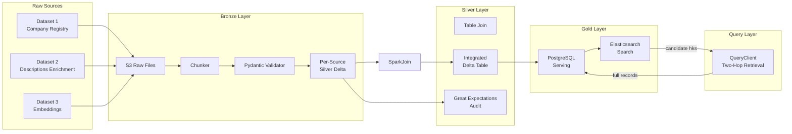

# Pipeline Overview

An end-to-end data integration pipeline that ingests company data from three heterogeneous sources, validates and aligns it through a medallion architecture (Bronze → Silver → Gold), and serves the unified dataset through PostgreSQL (relational queries) and Elasticsearch (full-text and semantic search). Built for production scale, designed to handle hundreds of millions of records with incremental processing, idempotent writes, and resume-on-failure.


- [Architecture](#architecture)
- [Data Model](#data-model)
  - [Source Datasets](#source-datasets)
  - [Data Formats](#data-formats)
  - [Join Strategy](#join-strategy)
  - [Assumptions](#assumptions)
- [Search and Retrieval](#search-and-retrieval)
- [Tech Stack](#tech-stack)
- [Setup and Execution](#setup-and-execution)
- [Environment Variables](#environment-variables)
- [Dashboard Documentation](#dashboard-documentation)
- [CLI Reference](#cli-reference)
- [Job Documentation](#job-documentation)
- [Project Structure](#project-structure)

## Architecture



Data flows left-to-right through four stages:

1. **Bronze** -- raw files land in S3, get chunked into Parquet pieces, validated row-by-row with Pydantic, and written to per-source Delta tables.
2. **Silver** -- Duckdb/PySpark joins the three per-source Delta tables on normalized URL into a single integrated Delta table. Great Expectations audits run on sampled data from all four Delta tables using weighted reservoir sampling.
3. **Gold** -- the integrated Delta table is streamed into PostgreSQL via idempotent upserts (hash-diff change detection). Search-relevant fields are then indexed into Elasticsearch.
4. **Query** -- a two-hop `QueryClient` queries ES for candidate record IDs, then fetches full records from PostgreSQL, preserving ES ranking order.

## Data Model

### Source Datasets

| Source | Description | Primary Key | Partition Key | Join Key |
|--------|-------------|-------------|----------|---------|
| **Dataset 1** | Company registry -- identifiers, location, industry, financials, founding year | `company_id` | `iso2_country_code` | `normalized_request_url` |
| **Dataset 2** | URL-keyed text enrichment -- business descriptions, products/services, market niches, business model | `normalized_request_url` | `substr(normalized_request_url,5)`| `normalized_request_url` |
| **Dataset 3** | URL-keyed embedding vectors -- dense vectors for business description, short description, products, niches, business model | `normalized_request_url` | `substr(normalized_request_url,5)` | `normalized_request_url` |

### Data Formats

**Dataset 1** (`dataset_1_generated.json`):

```json
{
  "company_id": "cmp_000001",
  "country": "Finland",
  "industry": "Fintech",
  "revenue_range": "100M-500M",
  "employee_count": 240,
  "founded_year": 2018,
  "short_description": null,
  "website_url": "www.nordic-fintech-solutions.ai"
}
```

**Dataset 2** (`dataset_2_generated.json`):

```json
{
  "url": "https://nordic-fintech-solutions.ai",
  "business_description": "The company provides software for fraud detection, risk analytics, and digital banking workflows for financial institutions.",
  "product_services": "AI underwriting\nFraud detection platform\nRisk monitoring\nBanking analytics dashboards",
  "market_niches": "Digital Banking\nPayments\nFinancial Infrastructure\nFinland",
  "business_model": "B2B | subscription fees | SaaS"
}
```

**Dataset 3** (`dataset_3.parquet`, originally JSON, replaced with real embeddings generated by `jinaai/jina-embeddings-v5-text-nano`):

```json
{
  "url": "https://www.nordic-fintech-solutions.ai",
  "global_emb": [-0.3907, "..."],
  "business_description_emb": [-0.3907, "..."],
  "product_services_emb": [-0.3907, "..."],
  "market_niches_emb": [-0.3907, "..."],
  "business_model_emb": [-0.3907, "..."],
  "short_description_emb": [-0.3907, "..."],
  "embedding_updated_at": "2024-10-21T06:52:31Z"
}
```

### Join Strategy

Dataset 1 is the seed (canonical entities). Datasets 2 and 3 are left-joined via `normalized_request_url`. The gold layer uses a deterministic hash key (`hk`) derived from the data source name plus `company_id` as the universal primary key (to avoid ID collision).

Datasets 2 and 3 are upserted on `normalized_request_url`. Because URLs are normalized (lowercase, stripped scheme/www/fragment/trailing slash), multiple raw URL variants that point to the same host collapse into a single key. This is intentional -- a `normalized_request_url` represents an entity.

### Assumptions

- Each entry in Dataset 1 corresponds to a single entity. Entries in Datasets 2 and 3 can map 1:N to entries in Dataset 1 (multiple companies may share the same URL).
- Datasets 2 and 3 are expected to be 1:1 on URL, but this is not enforced. If multiple embedding versions exist per URL (`embedding_updated_at`), the Delta merge (last-write-wins) retains the latest.

## Search and Retrieval

The `QueryClient` supports three search strategies, all combinable with structured filters (country, employee count, revenue, founded year, etc.):

| Strategy | `SearchFilters` fields | How it works |
|----------|----------------------|--------------|
| **BM25 text search** | `query_text` | ES `multi_match` across text fields (description, industry, products, niches, business model) |
| **Semantic search** | `semantic_query` | Query text is embedded at search time via `EmbeddingClient` (`jinaai/jina-embeddings-v5-text-nano`), then ES KNN cosine search on one or more `dense_vector` fields |
| **Hybrid** | `query_text` + `semantic_query` | ES combines BM25 and KNN scores in a single request |

Semantic search supports two embedding modes:

- **Per-field** — targets individual embedding fields (e.g. search only product/services and market niches embeddings). When multiple fields are selected, ES runs one KNN clause per field and linearly combines their scores. Fields: `embedding_description_long`, `embedding_description_short`, `embedding_product_services`, `embedding_market_niches`, `embedding_business_model`.
- **Global** — uses a single `embedding_global_vector` field built by concatenating all non-null text fields into one document before embedding. Useful for broad semantic similarity when you don't need per-field granularity.


## Tech Stack

- **Language:** Python 3.13
- **Data lake:** Delta Lake (`deltalake` for Python-native reads/writes, `delta-spark` for PySpark integration)
- **Distributed compute:** PySpark (multi-source join at silver layer)
- **Serving database:** PostgreSQL 16
- **Search engine:** Elasticsearch 8.17 (full-text BM25, dense vector KNN, keyword filters)
- **Data validation:** Pydantic v2 (row-level schema enforcement), Great Expectations (statistical audits)
- **Data processing:** PyArrow, Polars (sampling and hashing)
- **Orchestration:** Apache Airflow 3.2 (CeleryExecutor, Docker task isolation)
- **Object storage:** MinIO (S3-compatible, local development)
- **Containerization:** Docker Compose (multi-service local environment)
- **Package management:** `uv`

## Setup and Execution

### Prerequisites

- Docker and Docker Compose
- [uv](https://docs.astral.sh/uv/) (`wget -qO- https://astral.sh/uv/install.sh | sh`)

### Local Environment

```bash
# Install Python virtual environment
make install

# Activate the environment (sources dev.env, activates venv)
make activate
```

### Infrastructure

```bash
# Build the pipeline Docker image and Airflow image
make docker-build

# Start all services (MinIO, PostgreSQL, Elasticsearch, Airflow)
make docker-up

# Stop all services
make docker-down
```

### Running the Pipeline

**Full pipeline (local demo):**

```bash
dip pipeline
```

**Individual stages (in order):**

```bash
dip download-bronze    # Download test data from public bucket to local filesystem
dip upload-bronze      # Upload test data to S3
dip chunk-bronze       # Chunk raw files into Parquet and archive originals
dip process-bronze     # Validate chunks with Pydantic, write processed Parquet + errors
dip load-bronze        # Write validated data to per-source Silver Delta tables
dip audit-silver       # Run Great Expectations audits on Silver Delta tables
dip integrate-silver   # PySpark join into integrated Delta
dip sync-pg            # Stream integrated Delta to PostgreSQL
dip sync-es            # Index PostgreSQL records into Elasticsearch
```

**Maintenance:**

```bash
dip optimize-delta     # Compact Delta table files (Z-order if configured)
dip vacuum-delta       # Remove old Delta file versions beyond retention period
```

**Reporting and UIs:**

```bash
dip pg-report          # Create or replace the summary view in Postgres
dip audit-docs         # Serve Great Expectations HTML audit reports (default port 8088)
dip streamlit          # Launch Streamlit data explorer UI (default port 8501)
```

### Service UIs

| Service | URL | User | Password |
|---------|-----|------|----------|
| Airflow | http://localhost:8080 | `airflow` | `airflow` |
| Kibana (ES) | http://localhost:5601 | `elastic` | `elastic123` |
| MinIO Console | http://localhost:9001 | `user123` | `password123` |

## Environment Variables

All configuration is driven by environment variables, loaded through `settings.py`. Connection variables are global (used by multiple jobs); task-specific variables are documented in each job's page.

### Connection: S3

| Variable | Default | Description |
|---|---|---|
| `S3_ACCESS_KEY` | *(required)* | S3/MinIO access key |
| `S3_SECRET_ACCESS_KEY` | *(required)* | S3/MinIO secret key |
| `S3_HOST` | *(required)* | S3/MinIO hostname |
| `S3_PORT` | *(required)* | S3/MinIO port |
| `S3_ENDPOINT_URL` | `http://{S3_HOST}:{S3_PORT}` | Full endpoint URL (auto-derived from host and port if not set) |

### Connection: PostgreSQL

| Variable | Default | Description |
|---|---|---|
| `POSTGRES_HOST` | *(required)* | PostgreSQL hostname |
| `POSTGRES_PORT` | *(required)* | PostgreSQL port |
| `POSTGRES_USER` | *(required)* | PostgreSQL username |
| `POSTGRES_PASSWORD` | *(required)* | PostgreSQL password |
| `POSTGRES_DATABASE` | *(required)* | PostgreSQL database name |
| `POSTGRES_CONNECTION_TIMEOUT` | `10` | Seconds before a Postgres connection attempt times out |

### Connection: Elasticsearch

| Variable | Default | Description |
|---|---|---|
| `ELASTICSEARCH_URL` | *(required)* | Elasticsearch URL (e.g. `https://localhost:9200`) |
| `ELASTICSEARCH_USER` | *(required)* | Elasticsearch username |
| `ELASTICSEARCH_PASSWORD` | *(required)* | Elasticsearch password |

### Connection: Spark

| Variable | Default | Description |
|---|---|---|
| `SPARK_APP_NAME` | `dip-spark` | Spark application name |
| `SPARK_HOST` | `127.0.0.1` | Spark driver bind address |
| `SPARK_MASTER` | `local[*]` | Spark master URL (`local[*]` for local, cluster URL for distributed) |
| `SPARK_DRIVER_MEMORY` | `4g` | Memory allocated to the Spark driver |
| `SPARK_EXECUTOR_MEMORY` | `4g` | Memory allocated to each Spark executor |

### Global Variables

| Variable | Default | Description |
|---|---|---|
| `DEBUG` | `0` | Enable debug mode (`1` = on) |
| `DATA_BUCKET` | `data` | S3 bucket used for all pipeline reads, writes, and metadata |
| `LOG_DELAY` | `60` | Seconds between periodic metric log messages during streaming jobs |
| `SYNC_METADATA_FREQUENCY` | `600` | Seconds between resume-state metadata flushes (bounds re-work after crash) |
| `EMBEDDING_DIMENSIONS` | `256` | Dense vector dimensionality used across silver schemas and ES index mappings |
| `EMBEDDING_MODEL_NAME` | `jinaai/jina-embeddings-v5-text-nano` | Embedding model used by `EmbeddingClient` for semantic search |
| `STREAMLIT_CACHE_TTL` | `300` | Streamlit resource cache TTL in seconds |
| `HASH_DIFF_COLUMN` | `hdiff` | Column name used for merge change-detection in Delta upserts |
| `LOAD_LDTS_COLUMN` | `load_ldts` | Timestamp column added to each record on Delta write |
| `SYNC_LDTS_COLUMN` | `sync_ldts` | Timestamp column added to each record on PG/ES write |
| `BRONZE_DATA_FOLDER` | `bronze` | Local directory name under `tests/data/` and the S3 key prefix for uploaded files |
| `DEFAULT_CHUNK_SIZE` | `10000` | Number of rows per Parquet chunk |


## Dashboard Documentation

- [streamlit dashboard](gold/streamlit.md) -- page-by-page guide for the Streamlit UI, search behavior, caching, and troubleshooting

## CLI Reference

| Command | Description |
|---------|-------------|
| `dip download-bronze` | Download test data from public Hetzner bucket to `tests/data/` |
| `dip upload-bronze` | Upload test data from `tests/data/` to S3 `bronze/` |
| `dip chunk-bronze` | Chunk raw bronze files into Parquet and archive originals |
| `dip process-bronze` | Validate bronze chunks row-by-row, write processed Parquet + error files |
| `dip load-bronze` | Merge processed Parquet chunks into per-source Silver Delta tables |
| `dip list-bronze-errors` | Emit JSON report of all validation error files under `archived_bronze/` |
| `dip audit-silver` | Run Great Expectations audits on Silver Delta tables |
| `dip integrate-silver` | PySpark join of per-source Silver Deltas into integrated Delta |
| `dip sync-pg` | Stream integrated Delta into PostgreSQL with idempotent upserts |
| `dip sync-es` | Index PostgreSQL records into Elasticsearch |
| `dip optimize-delta` | Compact Delta table files (Z-order if configured) |
| `dip vacuum-delta` | Remove old Delta file versions beyond retention period |
| `dip pg-report` | Create or replace `integrated_records_report` summary view in Postgres |
| `dip audit-docs` | Serve Great Expectations HTML audit reports locally (`--port`, default 8088) |
| `dip streamlit` | Launch Streamlit data exploration UI (`--port`, default 8501) |
| `dip pipeline` | Run the full pipeline end-to-end sequentially |

## Job Documentation

Each pipeline job has detailed documentation covering how it works, the core modules it delegates to, metadata models, design reasoning, tradeoffs, and assumptions.

**Bronze layer:**

- [download_bronze](bronze/download_bronze.md) -- download test data from public bucket
- [upload_bronze](bronze/upload_bronze.md) -- upload local test data to S3
- [chunk_bronze](bronze/chunk_bronze.md) -- chunk raw files into Parquet, archive originals
- [process_bronze](bronze/process_bronze.md) -- validate and transform chunks with Pydantic
- [load_bronze](bronze/load_bronze.md) -- write processed chunks to Silver Delta tables
- [list_bronze_errors](bronze/list_bronze_errors.md) -- reconciliation report of validation errors

**Silver layer:**

- [integrate_silver](silver/integrate_silver.md) -- PySpark multi-source join into integrated Delta
- [optimize_delta_tables](silver/optimize_delta_tables.md) -- compact Delta table files
- [vacuum_delta_tables](silver/vacuum_delta_tables.md) -- remove old Delta file versions
- [audit_silver](silver/audit_silver.md) -- Great Expectations audits with weighted sampling

**Gold layer:**

- [sync_postgres](gold/sync_postgres.md) -- stream integrated Delta to PostgreSQL
- [sync_elastic_search](gold/sync_elastic_search.md) -- index PostgreSQL records into Elasticsearch
- [create_pg_report](gold/create_pg_report.md) -- create summary view in PostgreSQL

## Project Structure

```
src/data_integration_pipeline/
├── bronze/                     # Bronze layer: ingestion, validation, Delta writes
│   ├── core/                   #   Chunker, Processor, Loader logic
│   │   └── metadata/           #   Processing metadata models
│   └── jobs/                   #   CLI-callable job orchestrators
├── silver/                     # Silver layer: integration, maintenance
│   ├── core/                   #   PySpark join processor
│   │   └── metadata/           #   Integration/vacuum/optimize metadata
│   └── jobs/                   #   Integration, optimize, vacuum jobs
├── gold/                       # Gold layer: serving backends
│   ├── core/                   #   Postgres sync, ES sync processors
│   │   └── metadata/           #   Sync metadata with resume state
│   ├── io/                     #   PostgresClient, ElasticsearchClient, QueryClient
│   └── schemas/                #   PG DDL (SQL), ES index mapping (Python)
├── auditor/                    # Data quality: Great Expectations audits
│   ├── core/                   #   Audit runner, rule definitions
│   └── io/                     #   Weighted reservoir sampler
├── common/                     # Shared infrastructure
│   ├── core/                   #   Utilities, hashing, timestamps, timed triggers
│   │   └── models/             #   Pydantic data models per source + integrated
│   │       ├── dataset_1/      #     Company registry schemas
│   │       ├── dataset_2/      #     URL enrichment schemas
│   │       ├── dataset_3/      #     Embedding schemas
│   │       ├── integrated/     #     Merged schemas (bronze, silver, gold, ES)
│   │       ├── templates/      #     Base model classes (Bronze, Silver, Gold, MetaModel)
│   │       └── utils/          #     URL normalization, country standardization
│   └── io/                     #   Delta client, Spark client, S3 storage
├── streamlit/                  # Streamlit UI (data explorer, search, quality)
├── cli.py                      # CLI entrypoint (argparse, all subcommands)
└── settings.py                 # Environment-driven configuration
```
